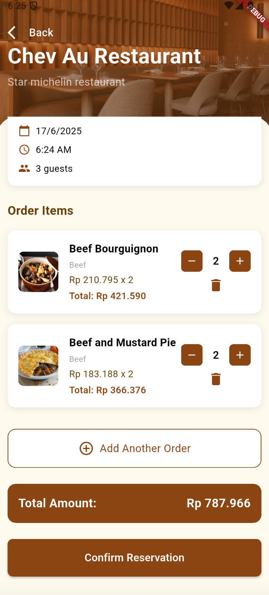

# Final Project Mobile Programming Class C

## Aplikasi Flutter reservasi makanan pada restoran (DineEase)

## Daftar Anggota Kelompok

| Nama Anggota                      | NRP        |
| --------------------------------- | ---------- |
| Jesse Robinson Junior Simanjuntak | 5025221024 |
| Gilang Kista Ramadhan             | 5025221173 |
| Arya Gading Prinandika            | 5025221280 |

## Deskripsi Aplikasi

Aplikasi ini merupakan aplikasi reservasi makanan pada restoran dengan menggunakan API yang terintegrasi dengan themealdb.com dan AI dari Gemini. Aplikasi ini memungkinkan pengguna untuk mencari makanan, melihat detail makanan, melakukan reservasi, dan mendapatkan rekomendasi makanan berdasarkan preferensi pengguna.

## API yang Digunakan

- **Own API**: `https://fp-ppb.aryagading.com/api/`
- **TheMealDB API**: `https://www.themealdb.com/api/json/v1/1/`
- **Gemini API**: `https://generativelanguage.googleapis.com/v1beta/models/gemini-2.0-flash:generateContent`

## Fitur Aplikasi

### Transaksi Reservasi Makanan dan List Menu dari API (Jesse Robinson Junior Simanjuntak)

- Pengguna dapat melakukan reservasi makanan dengan memilih makanan yang tersedia.
- Pengguna dapat mengubah jumlah makanan yang dipesan.
- Pengguna dapat menentukan berapa orang yang akan ikut.

### Preferensi Makanan (Arya Gading Prinandika)

- Pengguna dapat memilih preferensi makanan seperti halal, vegetarian, dan lainnya.
- Preferensi makanan akan digunakan untuk memberikan rekomendasi makanan yang sesuai.

  

### Review Makanan (Gilang Kista Ramadhan)

- Pengguna dapat memberikan review terhadap transaksi yang telah dilakukan.
- Review akan ditampilkan pada halaman detail makanan.

  

### Rekomendasi Makanan melalui Chatbot AI (Arya Gading Prinandika)

- Pengguna dapat berinteraksi dengan chatbot AI untuk mendapatkan rekomendasi makanan.
- Chatbot AI akan memberikan rekomendasi makanan berdasarkan preferensi pengguna.

### Halaman Lainnya

<table>
    <tr>
        <td align="center">
             Login Page
        </td>
        <td align="center">
             Register Page
        </td>
    </tr>
    <tr>
        <td align="center" colspan="2">
             Home Page
        </td>
    </tr>
</table>
